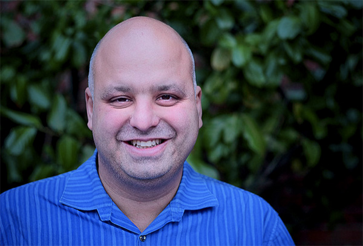

After years of dedicated work building their organization, the Malmö branch of
socialist party Vänsterpartiet (The Left Party) in 2013 booted up their
election machine. The "super election year", as it was deemed by media, was
around the corner, with European elections in May and national and local
elections in September. It was then that Vänsterpartiet started using Zetkin,
in fact, it was then that Zetkin was first conceived.

– We had a strong hunch that there was this unused potential, that we had
strong support and that there were people willing to go out into the streets
for Vänsterpartiet.

<figure markdown="1">

*Daniel Sestrajcic*
</figure>

Daniel Sestrajcic, experienced organized and today MP and chairman of Zetkin
Foundation, was at the time campaign manager in the local party branch. He had
long seen a need to lower thresholds for becoming active.

– Zetkin made it easier for more people to sign up for our campaign actions.
Harnessing the will to help suddenly became so much more possible.

And it quickly showed results.

Zetkin was used during the winter and spring to organize a number of campaigns.
It was also used to manage a hundred volunteers during the largest May 1st march
in modern day Malmö, and the very successful street festival "Our city", both
with thousands of visitors. Spring campaigning peaked with the European
elections in May. Zetkin was used to organize all on-the-ground activities.

From having previously counted campaign participation in the double digits, on
election day the tally showed 200 activists had participated in the campaign.
Six months earlier, organizing a third of the member base this way would not
have been manageable.

The challenge no longer was organizing all who wanted to help, but to reach out
to the next circle of people. The next step was to start calling members
systematically using the Zetkin phone banking features.

– Zetkin had already raised to bar on how many we could organize. Now we were
also able to start mobilizing more, Daniel explains.

Mobilizing over the phone on this scale would turn out to be a revolution for
the organization.

<figure markdown="1">

*Zetkin provided an overview of how the campaign progressed all over the city*
</figure>

The september elections in 2014 became the ultimate manifestation of strength.
During the three most intensive weeks of the campaign, more than 400 people
participated. Everyday, ten or so activists were on the phones, mobilizing
more activists for the coming days. Simultaneously, a hundred or so were out
in the streets talking to voters. On election day, almost every polling station
was manned from open to close.

Other parties in the city could not hide their jealousy. When the votes had
been counted, jealousy seemed fit. The Left Party had increased their share of
the vote more than any other party, and broken into important parts of the city
where they previously stood little chance.

– A strong organization and successful campaigning require many components,
organizational as well as political. Long term work was crucial to our success,
says Daniel Sestrajcic, and rounds up:

– Thanks to Zetkin we could convert the potential we had built up into actual
mobiliziing, organiziing and votes.

_Are you thinking about how to organize an election campaign with Zetkin? Zetkin
Foundation can help you with everything from analyzing conditions to planning
campaign actions.
[Contact us](/en/contact)._
