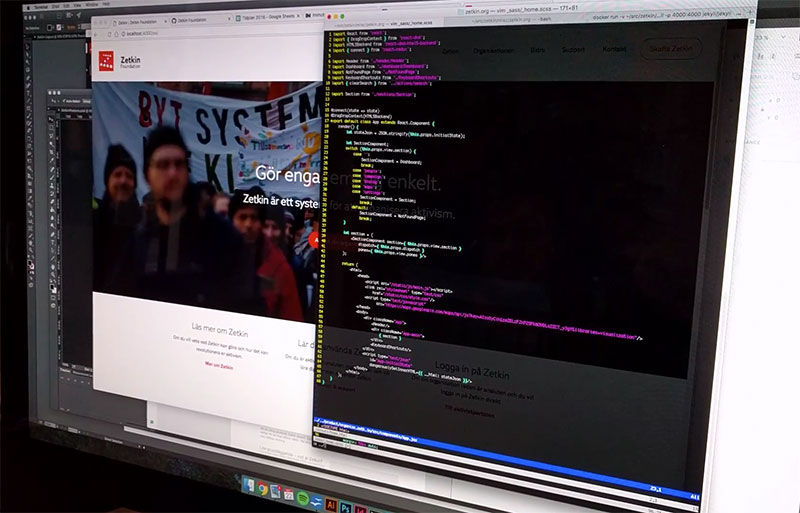

Zetkin is a web based platform for organizing activism using tools that make
participation easier and simplifies common tasks in activist organizations.

Zetkin Foundation is a part of Vänsterpartiet Malmö, developing Zetkin and
working to spread successful organizing methods to the Swedish and
international left.

* [Read more about Zetkin](/en/zetkin)
* [Read more about Zetkin Foundation](/en/foundation)

## Hacktivists needed
Most of the work in Zetkin Foundation is done by volunteers, but there is also
paid work. Right now we are looking for developers to help us with one of our
on-going projects.

<figure markdown="1">

</figure>

We really want to hear from you if you know (or are willing to learn) one of
the following, and want to be part of our development team.

* Responsive design with CSS/SASS
* React/Redux (or similar)
* Python for server development
* Integrating third-party payment systems (probably Stripe)

### Paid and volunteer work
We hope that you are willing to contribute as a volunteer for the long term,
and take on paid work during limited periods of time. Perfect on the side of
studies or between two freelance gigs.

All our paid staff are paid a unified fee based on salaries in Vänsterpartiet.
It is not something that can compete with comercial salaries so it is
important that ou believe in our project and want your work to contribute to
the advancement of the left.

We are primarily looking for someone who can participate on-site in Malmö, at
least from time to time.

Please get in touch if you want to contribute to organizing the left in Sweden
and abroad. Send us an e-mail at [info@zetkin.org](mailto:info@zetkin.org).
