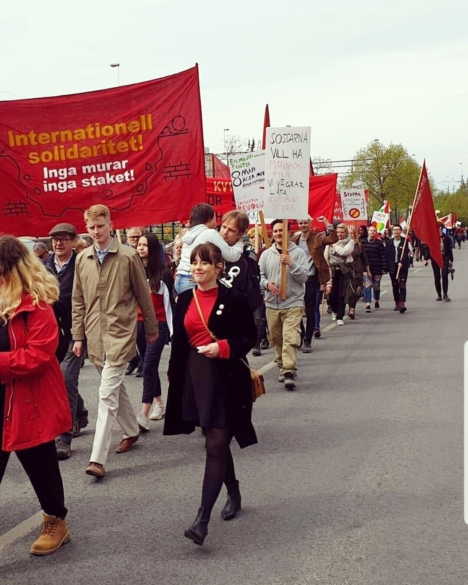

## 1. Vem är du?
Jag heter Nathalie Söderberg och jobbar som organisatör på Zetkin Foundation. Jag bor i Eskilstuna i en hyresrätt med mina två katter. Jag har en bakgrund som aktivist i Vänsterpartiet och andra organisationer och tror på rörelsens kraft. Det är det jag har och fortsätter lägga mitt fokus på. På fritiden gillar jag att dricka vin med vänner, hänga i naturen och bada nu när det är sommar!

## 2. Vad är utvecklingsfonden och vad är dess syfte?
Zetkin Foundation har med små resurser startat och utvecklat plattformen Zetkin som idag är en av vänsterns bästa plattformar för organisering av aktivism. De skräddarsydda verktyg vi erbjuder underlättar och effektiviserar organisatörens arbete med att engagera aktivister. För att nå nästa nivå och utveckla Zetkin ännu mer krävs en starkare ekonomi. Därför startar vi nu en utvecklingsfond! Syftet med fonden är att satsa på nya funktioner. Zetkin Foundation bärs upp av volontärer och deltidsanställda. Med en starkare ekonomi kan vi göra ännu mer för att stärka rörelsebyggandet.

<figure markdown="1">

*Nathalie Söderberg*
</figure>

## 3. Varför vill vi som vänsterrörelse ha en utvecklingsfond?
Organisering är A och O för att växa som rörelse, och det vill ju vi i vänstern göra. Jag som är aktiv i Vänsterpartiet Eskilstuna har själv använt mig av plattformen Zetkin tillsammans med andra organisatörer och det har gjort vårt jobb mycket enklare och resulterat i en rejält ökad aktivitetsgrad. Det är just det Zetkin finns till för, att förenkla för organisatörer så att vi kan fokusera på att bygga relationer med medlemmar och aktivister istället för det administrativa arbetet. Zetkin sköter det åt oss. Det blir inget extraval den närmsta framtiden men kampen mot marknadshyror påminde oss om att vi måste vara redo för mobilisering. Vi har ett högerauktoritärt block som vill styra och en regering som kompromissar med kapitalet. Kampen för ett jämlikt och solidariskt samhälle existerar alltså i allra högsta grad kvar och att vi i vänstern lyckas organisera en stark valrörelse inför valet 2022 kommer bli avgörande för att vinna fler segrar.

## 4. Hur mycket pengar skulle vi vilja samla in till Utvecklingsfonden?
Vårt mål är att samla in 75 000 kr innan året är slut! Om 15 stycken partiföreningar bidrar med 5000 kr var har vi nått det målet och kan göra så mycket mer med plattformen och med det vänsterrörelsen. Jag vet att partiföreningar har olika ekonomiska situationer, vissa kan bidra med mer och andra med mindre. Vänstern har inte en massa rika finansiärer som högern har, men vår styrka är att vi är många och vet hur vi går samman.

## 5. Hur kan man bidra till Utvecklingsfonden?
Man kan bidra genom att skänka den summa som är möjlig för ens organisation. Om många bidrar med det de kan så kan vi göra underverk tillsammans. Sätt in ditt bidrag på bankgiro 895-0131, eller skicka med Swish till 123 412 17 03, och märk betalningen “Utvecklingsfond”. Man kan också mejla mig på nathalie.soderberg@zetkin.org för mer information.

## 6. Vem och vilka kan skänka till Utvecklingsfonden?
I praktiken alla som tror på organisering! Men jag vet att de partiföreningar som
idag använder sig av plattformen Zetkin och tidningsprojektet “Vänstern i...” ser
vilken betydelse det har haft i arbetet med att engagera medlemmar och bli fler. Och det till ett lågt pris. Det
finns även ett stort värde för oss i vänstern att äga vår egen infrastruktur för att slippa förlita oss på kommersiella storföretag. Varje krona går tillbaka till rörelsen då vi inte tar ut några vinster. Flera har redan frågat hur de kan bidra till Zetkin Foundations arbete och vårt svar på
det är att starta utvecklingsfonden. Jag hoppas att många vill bidra!
