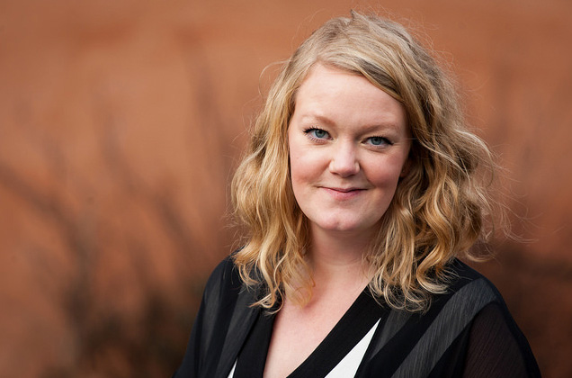
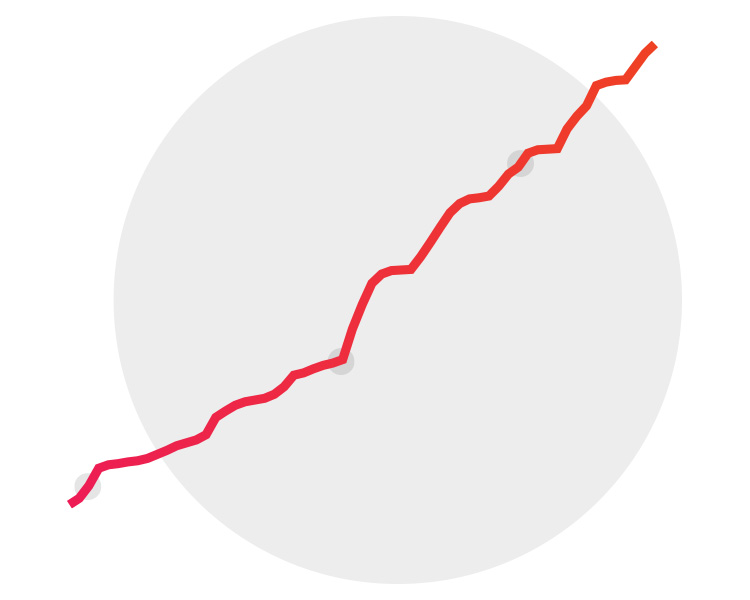

Som lösning på utmaningen att bli en mer inkluderande organisation som tar vara
på medlemmarna är enkäten så enkel att den blir genialisk. Med ett tjugotal
frågor vill partiföreningen inventera varje medlems kompetenser, ta reda på
deras önskemål och lista ut vad de behöver för att kunna bli aktiva.

Enkäten introducerades 2011 och var en viktig komponent i att hitta alla de
aktivister som gjorde valrörelsen 2014 till en succé. Svar samlas in
kontinuerligt, men riktigt många svar får man enligt partiföreningens
erfarenhet bara när man aktivt jobbar för det. Sedan 2015 görs enkäten i
Zetkin.

Svaren används för att göra segmenterade utskick och inbjudningar, utforma
de aktiviteter som medlemmarna efterfrågar och ta vara på den bredd av
kompetens som medlemmarna sitter på. Ibland hittar man guldkorn – kompetens
man inte tänkt på eller kunnat gissa fanns i organisationen.

<figure markdown="1">

*Emma-Lina Johansson*
</figure>

– Den här omgången har vi bland annat hittat en cykelreparatör, en
orkidéeodlare, minst en som vill baka kanelbullar och en expert på Malmös
överbelastade vatteninfrastruktur.

Emma-Lina Johansson jobbar i Vänsterpartiet Malmö och är en av de ansvariga för
2016 års insamling av medlemsenkäten. Hon blir peppad av att läsa enkätsvaren
och ser fram emot att kunna dra nytta av all den information de fått in.

Förra gången fick man in ungefär 300 svar genom att ringa runt. Denna gång var
målet betydligt högre – 800 svar. För att uppnå det gjorde man en tydlig plan,
och utrustade sig med Zetkins enkät- och telefonverktyg.

– Under augusti och september spred vi enkäten i varenda kanal vi har, men det
var när vi började ringa systematiskt med Zetkin som det verkligen tog fart.

Emma-Lina visar ett diagram över utvecklingen och pekar ut de olika utskicken
via Facebook, e-post och SMS. Det är inte svårt att utläsa var ringningen kom
igång. En gigantisk puckel en månad efter första nyhetsbrevet markerar starten
på en sex veckor lång ringkampanj.

<figure markdown="1">

*En tydlig puckel mitt i diagrammet markerar den första av sex veckor med
systematiskt ringande*
</figure>

Varje vecka anordnades ringpass fyra kvällar och vissa veckor en helgdag.
Anmälningar till passen togs in genom Zetkins kampanjverktyg. Omkring tjugo
aktivister deltog någon eller några gånger varje vecka, vilket skapar en
kampanjkänsla bland de aktiva. Parallellt med ringningen jobbade en liten
grupp med uppföljning.

– Genom att hålla koll på samtalsloggen och de svar som kom in kunde vi följa
upp varje svar, hålla koll på vilka som valde att fylla i enkäten själva och
ringa tillbaka till dem som glömt.

En av frågorna i enkäten handlar om att donera pengar. Med enkäten hittade
partiföreningen under perioden nästan hundra nya månadsgivare, uppskattningsvis
ca 50 000 kr i nya intäkter per år. Emma-Lina berättar att det överträffade
allas förhoppningar, och att det inte hade varit möjligt utan Zetkin.

– Att kunna ringa så systematiskt som vi gjorde bygger inte bara
organisationen starkare, utan gav dessutom intäkter långt över våra utgifter
för Zetkin.

_Vill du börja arbeta med en medlemsenkät i Zetkin? Zetkin Foundation kan
hjälpa dig med allt från att skapa enkäten till att planera och genomföra
ringningar med din organisations volontärer.
[Kontakta oss](/sv/kontakt)_
